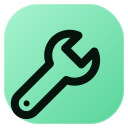

<p align="center">
  
</p>

<h1 align="center">wrench — تب جدید مینیمال</h1>

<p align="center">
  یک فضای تب جدید خلوت، متن‌باز و Local-First برای مدیریت بوکمارک‌ها، تمرکز، پس‌زمینه‌های اختصاصی و جست‌وجوی سریع.
</p>

<p align="center">
  <a href="README.md">English</a> ·
  <a href="#نصب">نصب</a> ·
  <a href="PRIVACY.md">حریم خصوصی</a> ·
  <a href="CONTRIBUTING.md">مشارکت</a>
</p>


## wrench چه کاری انجام می‌دهد؟

wrench صفحه پیش‌فرض New Tab را به یک محیط آرام و کاربردی تبدیل می‌کند. صفحه‌ها، بردها، بوکمارک‌ها، تنظیمات و تصاویر انتخابی کاربر داخل مرورگر ذخیره می‌شوند و برای استفاده از امکانات اصلی نیازی به حساب کاربری، تبلیغات یا سرور اختصاصی پروژه نیست.

## امکانات

- ساخت صفحه و بردهای بوکمارک کشویی
- Command Search با میان‌بر `Ctrl/Command + Shift + K`
- جست‌وجو در بوکمارک‌ها، جست‌وجوهای اخیر و آدرس‌های مستقیم
- پیشنهادهای زنده Google به‌صورت اختیاری در نسخه Chromium
- انتقال امن Bookmark Bar با مجوز اختیاری
- پس‌زمینه تصویری، ویدئویی، گرادیانی و مجموعه داخلی
- تایمر Focus و Break
- رابط فارسی و انگلیسی و فونت‌های متنوع
- بکاپ و بازیابی JSON
- ذخیره سریع صفحه فعلی از Popup و منوی راست‌کلیک
- خروجی Chrome، Edge، Brave، Opera، Vivaldi و Firefox

## نصب

### Chrome و مرورگرهای Chromium

1. فایل Chromium را از بخش [Releases](../../releases) دانلود و Extract کن.
2. وارد `chrome://extensions` شو.
3. **Developer mode** را روشن کن.
4. روی **Load unpacked** بزن و پوشه Extractشده را انتخاب کن.

### Firefox

1. فایل Firefox را از بخش [Releases](../../releases) دانلود و Extract کن.
2. وارد `about:debugging#/runtime/this-firefox` شو.
3. روی **Load Temporary Add-on** بزن.
4. فایل `manifest.json` را انتخاب کن.

برای نصب دائمی Firefox باید بسته توسط AMO امضا شود.

## ساخت خروجی

پروژه وابستگی Build خارجی ندارد و Python 3.10+ کافی است:

```bash
git clone https://github.com/Aliazadi-1776/wrench-new-tab.git
cd wrench-new-tab
python build.py
```

خروجی‌ها:

```text
wrench-chrome-v1.7.0.zip
wrench-firefox-v1.7.0.zip
```

## حریم خصوصی

امکانات اصلی به‌صورت محلی اجرا می‌شوند. پیشنهادهای زنده Google در نسخه Chromium به‌صورت پیش‌فرض خاموش‌اند؛ تنها پس از فعال‌سازی توسط کاربر، متن تایپ‌شده بدون Cookie مستقیماً برای سرویس پیشنهاد Google ارسال می‌شود. نسخه Firefox پیشنهاد زنده Remote ندارد. جزئیات در [PRIVACY.md](PRIVACY.md) آمده است.

## لینک‌ها

- GitHub: https://github.com/Aliazadi-1776
- Telegram: https://t.me/im_wrench
- Issues: https://github.com/Aliazadi-1776/wrench-new-tab/issues

## مجوز

این پروژه تحت مجوز [MIT](LICENSE) منتشر شده است.
